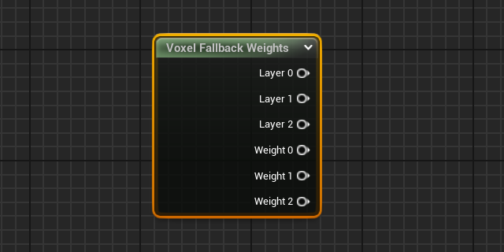

# Installing Voxel Plugin


This release is targeted at Unreal Engine 5.4.



In order to install the 2.0 preview, ownership of Voxel Plugin Pro Legacy is required.


### 1. Downloading Voxel Plugin Installer from the Unreal Engine Marketplace


Skip to [Section 2.1](installing-voxel-plugin.md#id-2.1-linking-accounts) for retrieving the plugin from Github.


To start off, open the Epic Games Launcher. In the Unreal Engine section, navigate to Fab and use the search-bar to look for “Voxel Plugin Installer”. Find the “Voxel Plugin Installer” result, with “Voxel Plugin” as creator, and click it.

<figure><figcaption></figcaption></figure>

* With the store page open, click the “Add to my Library” button to get access to the plugin
* You will be prompted to log in if you aren’t already, and to accept the Epic Content License Agreement
* Back in the Epic Launcher, scroll down in the Library section and look for Voxel Plugin Installer under the Fab Library heading. &#x20;
* Press the "Install to Engine" button, select the engine version you are working in the slot dropdown and press "Install"
*   The plugin will now download and install.&#x20;

    <figure><figcaption></figcaption></figure>

### 2. Setting up Voxel Plugin Installer & Verifying Ownership

Once this has finished, start the project you want to use Voxel Plugin in. In this project, go to "Edit -> Plugins" to open the Plugin browser.

<figure><figcaption></figcaption></figure>

With the plugin window open, use the search bar to look for "Voxel Plugin Installer". If it does not appear, try restarting the engine and looking again.

Tick the checkbox to the left of the Voxel Plugin Installer icon, and press the "Restart Now" button in the bottom right.

<figure><figcaption></figcaption></figure>

After restarting, a Voxel Plugin icon will have appeared on the right-hand side of your editor's toolbar, next to the "Settings" dropdown.&#x20;

<figure><figcaption></figcaption></figure>

Click the Voxel Plugin icon and a dropdown menu will appear. In this menu, click the "Login" button. This will open a login page on the Voxel Plugin site in your browser.&#x20;

#### 2.1 Linking Accounts

On the Voxel Plugin website, [create an account](https://voxelplugin.com/register) if you do not have one yet, and verify your email address.

Once logged in, you will be taken to the account dashboard. Click the "Connect" button in the Epic Games Account section.&#x20;

<figure><figcaption></figcaption></figure>

On the page that opens, log into the Epic account on which you own Voxel Plugin Pro. Click "Allow" on the Epic Games Account pop-up; these permissions allow the plugin to remember your Epic ID.

<figure><figcaption></figcaption></figure>

Once finished, the page will close and you will be taken back to the account dashboard, where you will now see your Epic Games Account being successfully linked.

<figure><figcaption></figcaption></figure>


The automated verification pipeline is currently unavailable as Fab is spinning up.&#x20;

Send a direct message on Discord to the user @Phyronnaz  to be verified.


After verifying, the "Voxel Plugin Pro Legacy" section should update with a green banner, saying "Purchase verified".

<figure><figcaption></figcaption></figure>

After verifying plugin ownership, you can connect accounts for other services to your Voxel Plugin account from the Profile section of the Account Dashboard.&#x20;

Aside from your Epic account, you can connect:

* &#x20;a Github account, which will automatically be assigned access to the source code repositories for both VP Legacy and VP2.
* a Discord account, which will automatically be given access additional channels on [the Voxel Plugin Discord](https://discord.voxelplugin.com).&#x20;

### 3. Installing Voxel Plugin

With this done, go back to the Unreal Engine editor and click the Voxel Plugin icon again. The menu should now be different, allowing you to download Voxel Plugin 2. Select a version to install, whether you want it to be installed to the engine, and press the Install button.


If you have Voxel Plugin Pro Legacy installed on the engine version you're using:

* Voxel Plugin 2 **must** be installed to the project. Untick the "Install in engine" box.&#x20;
* Voxel Plugin Pro Legacy **must** be disabled in this project's plugin list. Only one version of Voxel Plugin can be active at once.


<figure><figcaption></figcaption></figure>

Once the download is finished, you will be prompted to restart the engine. After restarting the engine, the plugin will be installed.


If you originally purchased the plugin on Gumroad, reach out to Phyronnaz on [Discord](https://discord.voxelplugin.com).


And with that, you are finished - time to start creating!
