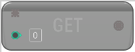

# Get

<figure><figcaption></figcaption></figure>

Given an array and an index, returns the item in the array at that index

## Inputs

<table><thead><tr><th width="170">Name</th><th>Description</th></tr></thead><tbody><tr><td>Values</td><td>Values</td></tr><tr><td>Index</td><td>Index</td></tr></tbody></table>

## Outputs

<table><thead><tr><th width="170">Name</th><th>Description</th></tr></thead><tbody><tr><td>Result</td><td>Result</td></tr></tbody></table>
