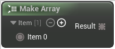

# Make Array

<figure><figcaption></figcaption></figure>

Create an array from a series of items

## Inputs

<table>
<thead><tr><th width="170">Name</th><th>Description</th></tr></thead>
<tbody>
<tr><td>Item 0</td><td>Item</td></tr>
</tbody>
</table>

## Outputs

<table>
<thead><tr><th width="170">Name</th><th>Description</th></tr></thead>
<tbody>
<tr><td>Result</td><td>Result</td></tr>
</tbody>
</table>