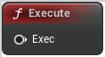

# Execute

<figure><figcaption></figcaption></figure>

Execute

## Inputs

<table><thead><tr><th width="170">Name</th><th>Description</th></tr></thead><tbody><tr><td>Exec</td><td>Exec</td></tr></tbody></table>

## Outputs
