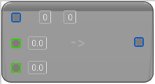

# To Double Linear Color (Int Point)

<figure><figcaption></figcaption></figure>

Cast from Int Point to Double Linear Color

## Inputs

<table>
<thead><tr><th width="170">Name</th><th>Description</th></tr></thead>
<tbody>
<tr><td>Int Point</td><td>Int Point to Double Linear Color</td></tr>
<tr><td>B</td><td>Int Point to Double Linear Color</td></tr>
<tr><td>A</td><td>Int Point to Double Linear Color</td></tr>
</tbody>
</table>

## Outputs

<table>
<thead><tr><th width="170">Name</th><th>Description</th></tr></thead>
<tbody>
<tr><td>Return Value</td><td>Int Point to Double Linear Color</td></tr>
</tbody>
</table>