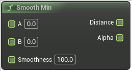

# Smooth Min

<figure><figcaption></figcaption></figure>

Smooth Min

## Inputs

<table><thead><tr><th width="170">Name</th><th>Description</th></tr></thead><tbody><tr><td>A</td><td>Smooth Min</td></tr><tr><td>B</td><td>Smooth Min</td></tr><tr><td>Smoothness</td><td>Smooth Min</td></tr></tbody></table>

## Outputs

<table><thead><tr><th width="170">Name</th><th>Description</th></tr></thead><tbody><tr><td>Out Distance</td><td>Smooth Min</td></tr><tr><td>Out Alpha</td><td>Smooth Min</td></tr></tbody></table>
