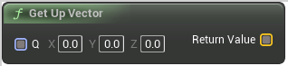

# Get Up Vector

<figure><figcaption></figcaption></figure>

Get Up Vector

## Inputs

<table>
<thead><tr><th width="170">Name</th><th>Description</th></tr></thead>
<tbody>
<tr><td>Q</td><td>Get Up Vector</td></tr>
</tbody>
</table>

## Outputs

<table>
<thead><tr><th width="170">Name</th><th>Description</th></tr></thead>
<tbody>
<tr><td>Return Value</td><td>Get Up Vector</td></tr>
</tbody>
</table>