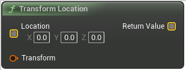

# Transform Location

<figure><figcaption></figcaption></figure>

Transform a position by the supplied transform.
For example, if Transform was an object's transform, this would transform a position from local space to world space.

## Inputs

<table>
<thead><tr><th width="170">Name</th><th>Description</th></tr></thead>
<tbody>
<tr><td>Location</td><td>Transform a position by the supplied transform.
For example, if Transform was an object's transform, this would transform a position from local space to world space.</td></tr>
<tr><td>Transform</td><td>Transform a position by the supplied transform.
For example, if Transform was an object's transform, this would transform a position from local space to world space.</td></tr>
</tbody>
</table>

## Outputs

<table>
<thead><tr><th width="170">Name</th><th>Description</th></tr></thead>
<tbody>
<tr><td>Return Value</td><td>Transform a position by the supplied transform.
For example, if Transform was an object's transform, this would transform a position from local space to world space.</td></tr>
</tbody>
</table>