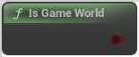

# Is Game World

<figure><figcaption></figcaption></figure>

False for editor preview, true for PIE, standalone...

## Inputs

## Outputs

<table><thead><tr><th width="170">Name</th><th>Description</th></tr></thead><tbody><tr><td>Return Value</td><td>False for editor preview, true for PIE, standalone...</td></tr></tbody></table>
