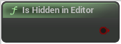

# Is Hidden in Editor

<figure><figcaption></figcaption></figure>

Is Hidden in Editor

## Inputs

## Outputs

<table><thead><tr><th width="170">Name</th><th>Description</th></tr></thead><tbody><tr><td>Return Value</td><td>Is Hidden in Editor</td></tr></tbody></table>
