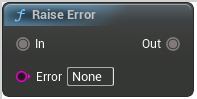

# Raise Error

<figure><figcaption></figcaption></figure>

Will raise an error whenever the output pin is queried

## Inputs

<table>
<thead><tr><th width="170">Name</th><th>Description</th></tr></thead>
<tbody>
<tr><td>In</td><td>In</td></tr>
<tr><td>Error</td><td>Error</td></tr>
</tbody>
</table>

## Outputs

<table>
<thead><tr><th width="170">Name</th><th>Description</th></tr></thead>
<tbody>
<tr><td>Out</td><td>Out</td></tr>
</tbody>
</table>