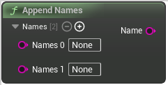

# Append Names

<figure><figcaption></figcaption></figure>

Append Names

## Inputs

<table><thead><tr><th width="170">Name</th><th>Description</th></tr></thead><tbody><tr><td>Names 0</td><td>Names</td></tr><tr><td>Names 1</td><td>Names</td></tr></tbody></table>

## Outputs

<table><thead><tr><th width="170">Name</th><th>Description</th></tr></thead><tbody><tr><td>Name</td><td>Name</td></tr></tbody></table>
