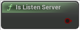

# Is Listen Server

<figure><figcaption></figcaption></figure>

Listen server: a server that also has a local player who is hosting the game, available to other players on the network

## Inputs

<table>
<thead><tr><th width="170">Name</th><th>Description</th></tr></thead>
<tbody>
</tbody>
</table>

## Outputs

<table>
<thead><tr><th width="170">Name</th><th>Description</th></tr></thead>
<tbody>
<tr><td>Return Value</td><td>Listen server: a server that also has a local player who is hosting the game, available to other players on the network</td></tr>
</tbody>
</table>