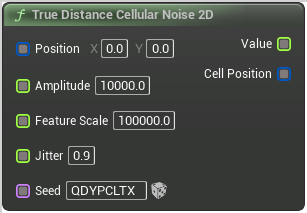

# True Distance Cellular Noise 2D

<figure><figcaption></figcaption></figure>

True Distance Cellular Noise 2D

## Inputs

<table>
<thead><tr><th width="170">Name</th><th>Description</th></tr></thead>
<tbody>
<tr><td>Position</td><td>Position</td></tr>
<tr><td>Amplitude</td><td>Amplitude</td></tr>
<tr><td>Feature Scale</td><td>FeatureScale</td></tr>
<tr><td>Jitter</td><td>Jitter</td></tr>
<tr><td>Seed</td><td>Seed</td></tr>
</tbody>
</table>

## Outputs

<table>
<thead><tr><th width="170">Name</th><th>Description</th></tr></thead>
<tbody>
<tr><td>Value</td><td>Value</td></tr>
<tr><td>Cell Position</td><td>CellPosition</td></tr>
</tbody>
</table>