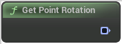

# Get Point Rotation

<figure><figcaption></figcaption></figure>

Voxel Template Node Get Point Rotation

## Inputs

## Outputs

<table><thead><tr><th width="170">Name</th><th>Description</th></tr></thead><tbody><tr><td>Rotation</td><td>Rotation</td></tr></tbody></table>
