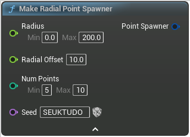

# Make Radial Point Spawner

<figure><figcaption></figcaption></figure>

Make Radial Point Spawner

## Inputs

<table><thead><tr><th width="170">Name</th><th>Description</th></tr></thead><tbody><tr><td>Radius</td><td>Radius</td></tr><tr><td>Radial Offset</td><td>In degrees</td></tr><tr><td>Num Points</td><td>NumPoints</td></tr><tr><td>Seed</td><td>Seed</td></tr></tbody></table>

## Outputs

<table><thead><tr><th width="170">Name</th><th>Description</th></tr></thead><tbody><tr><td>Point Spawner</td><td>PointSpawner</td></tr></tbody></table>
