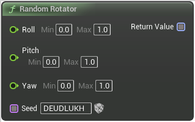

# Random Rotator

<figure><figcaption></figcaption></figure>

Random Rotator

## Inputs

<table>
<thead><tr><th width="170">Name</th><th>Description</th></tr></thead>
<tbody>
<tr><td>Roll</td><td>Roll</td></tr>
<tr><td>Pitch</td><td>Pitch</td></tr>
<tr><td>Yaw</td><td>Yaw</td></tr>
<tr><td>Seed</td><td>Seed</td></tr>
</tbody>
</table>

## Outputs

<table>
<thead><tr><th width="170">Name</th><th>Description</th></tr></thead>
<tbody>
<tr><td>Return Value</td><td>ReturnValue</td></tr>
</tbody>
</table>