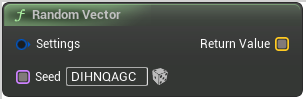

# Random Vector

<figure><figcaption></figcaption></figure>

Voxel Template Node Random Vector

## Inputs

<table><thead><tr><th width="170">Name</th><th>Description</th></tr></thead><tbody><tr><td>Settings</td><td>Settings</td></tr><tr><td>Seed</td><td>Seed</td></tr></tbody></table>

## Outputs

<table><thead><tr><th width="170">Name</th><th>Description</th></tr></thead><tbody><tr><td>Return Value</td><td>ReturnValue</td></tr></tbody></table>
