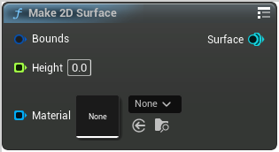

# Make 2D Surface

<figure><figcaption></figcaption></figure>

Make 2DSurface

## Inputs

<table>
<thead><tr><th width="170">Name</th><th>Description</th></tr></thead>
<tbody>
<tr><td>Bounds</td><td>Bounds</td></tr>
<tr><td>Height</td><td>Height</td></tr>
<tr><td>Material</td><td>Material</td></tr>
</tbody>
</table>

## Outputs

<table>
<thead><tr><th width="170">Name</th><th>Description</th></tr></thead>
<tbody>
<tr><td>Surface</td><td>Surface</td></tr>
</tbody>
</table>