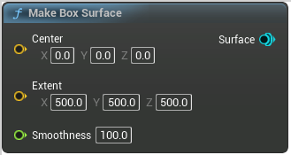

# Make Box Surface

<figure><figcaption></figcaption></figure>

Make a box surface in local space ie, the box will be relative to the current brush

## Inputs

<table><thead><tr><th width="170">Name</th><th>Description</th></tr></thead><tbody><tr><td>Center</td><td>Center</td></tr><tr><td>Extent</td><td>Extent</td></tr><tr><td>Smoothness</td><td>Will smooth out the box edges, same unit as Extent</td></tr></tbody></table>

## Outputs

<table><thead><tr><th width="170">Name</th><th>Description</th></tr></thead><tbody><tr><td>Surface</td><td>Surface</td></tr></tbody></table>
