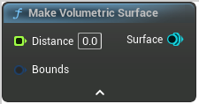

# Make Volumetric Surface

<figure><figcaption></figcaption></figure>

Make a surface from 3D distance field data

## Inputs

<table><thead><tr><th width="170">Name</th><th>Description</th></tr></thead><tbody><tr><td>Distance</td><td>Distance</td></tr><tr><td>Bounds</td><td>If not set will be infinite</td></tr></tbody></table>

## Outputs

<table><thead><tr><th width="170">Name</th><th>Description</th></tr></thead><tbody><tr><td>Surface</td><td>Surface</td></tr></tbody></table>
