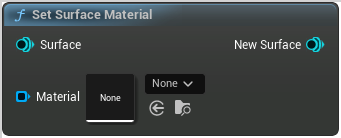

# Set Surface Material

<figure><figcaption></figcaption></figure>

Set Surface Material

## Inputs

<table><thead><tr><th width="170">Name</th><th>Description</th></tr></thead><tbody><tr><td>Surface</td><td>Surface</td></tr><tr><td>Material</td><td>Material</td></tr></tbody></table>

## Outputs

<table><thead><tr><th width="170">Name</th><th>Description</th></tr></thead><tbody><tr><td>New Surface</td><td>NewSurface</td></tr></tbody></table>
