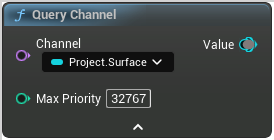

# Query Channel

<figure><figcaption></figcaption></figure>

Query Channel

<table>
<thead><tr><th width="250">Type</th><th width="200">Name</th><th>Description</th></tr></thead>
<tbody>
<tr><td>Channel</td><td>Channel</td><td>Channel</td></tr>
<tr><td>Integer</td><td>Max Priority</td><td>Only brushes with a priority strictly inferior to this will be sampled
Useful to sample a channel before the current graph affects it when drawing a preview mesh</td></tr>
<tr><td>Surface</td><td>Value</td><td>Value</td></tr>
</tbody>
</table>