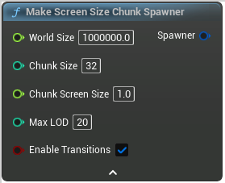

# Make Screen Size Chunk Spawner

<figure><figcaption></figcaption></figure>

Make Screen Size Chunk Spawner

## Inputs

<table>
<thead><tr><th width="170">Type</th><th width="170">Name</th><th>Description</th></tr></thead>
<tbody>
<tr><td>Float</td><td>World Size</td><td>World size in cm</td></tr>
<tr><td>Integer</td><td>Chunk Size</td><td>Size of a chunk in voxels</td></tr>
<tr><td>Float</td><td>Chunk Screen Size</td><td>Relative size of a chunk on screen
Smaller = higher quality</td></tr>
<tr><td>Integer</td><td>Max LOD</td><td>Max LOD to apply</td></tr>
<tr><td>Boolean</td><td>Enable Transitions</td><td>Add transition meshes in-between LODs to hide holes</td></tr>
</tbody>
</table>

## Outputs

<table>
<thead><tr><th width="170">Type</th><th width="170">Name</th><th>Description</th></tr></thead>
<tbody>
<tr><td>Chunk Spawner</td><td>Spawner</td><td>Spawner</td></tr>
</tbody>
</table>