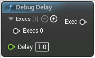

# Debug Delay

<figure><figcaption></figcaption></figure>

Debug Delay

## Inputs

<table>
<thead><tr><th width="250">Type</th><th width="200">Name</th><th>Description</th></tr></thead>
<tbody>
<tr><td>Exec</td><td>Execs 0</td><td>Execs</td></tr>
<tr><td>Float</td><td>Delay</td><td>Delay</td></tr>
</tbody>
</table>

## Outputs

<table>
<thead><tr><th width="250">Type</th><th width="200">Name</th><th>Description</th></tr></thead>
<tbody>
<tr><td>Exec</td><td>Exec</td><td>Exec</td></tr>
</tbody>
</table>