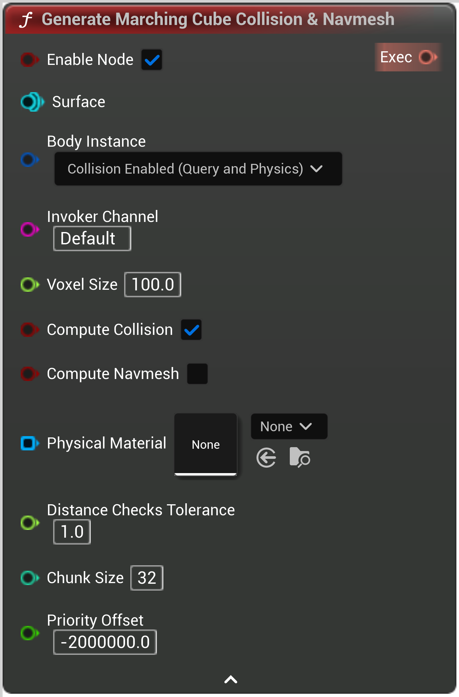

# Generate Marching Cube Collision & Navmesh

<figure><figcaption></figcaption></figure>

Voxel Marching Cube Collision Exec Node

<table>
<thead><tr><th width="250">Type</th><th width="200">Name</th><th>Description</th></tr></thead>
<tbody>
<tr><td>Boolean</td><td>Enable Node</td><td>If false, the node will never be executed</td></tr>
<tr><td>Surface</td><td>Surface</td><td>Surface</td></tr>
<tr><td>Body Instance</td><td>Body Instance</td><td>BodyInstance</td></tr>
<tr><td>Name</td><td>Invoker Channel</td><td>InvokerChannel</td></tr>
<tr><td>Float</td><td>Voxel Size</td><td>VoxelSize</td></tr>
<tr><td>Boolean</td><td>Compute Collision</td><td>ComputeCollision</td></tr>
<tr><td>Boolean</td><td>Compute Navmesh</td><td>ComputeNavmesh</td></tr>
<tr><td>Physical Material Buffer</td><td>Physical Material</td><td>PhysicalMaterial</td></tr>
<tr><td>Float</td><td>Distance Checks Tolerance</td><td>DistanceChecksTolerance</td></tr>
<tr><td>Integer</td><td>Chunk Size</td><td>ChunkSize</td></tr>
<tr><td>Double</td><td>Priority Offset</td><td>Priority offset, added to the task distance from camera
Closest tasks are computed first, so set this to a very low value (eg, -1000000) if you want it to be computed first</td></tr>
<tr><td>Exec</td><td>Exec</td><td>If not connected, will be executed automatically</td></tr>
</tbody>
</table>