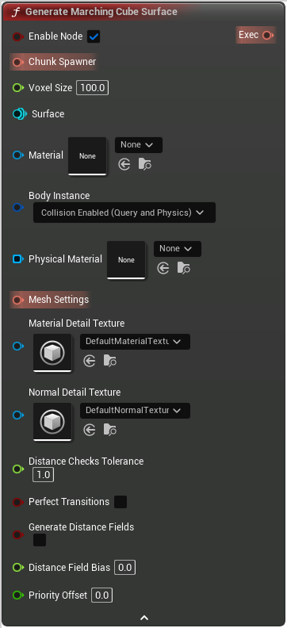

# Generate Marching Cube Surface

<figure><figcaption></figcaption></figure>

This node is entirely disabled on dedicated servers

<table>
<thead><tr><th width="250">Type</th><th width="200">Name</th><th>Description</th></tr></thead>
<tbody>
<tr><td>Boolean</td><td>Enable Node</td><td>If false, the node will never be executed</td></tr>
<tr><td>Chunk Spawner</td><td>Chunk Spawner</td><td>Defines where to spawn chunks & at what LOD
If not set will default to a Screen Size Chunk Spawner</td></tr>
<tr><td>Float</td><td>Voxel Size</td><td>The voxel size to use: distance in cm between 2 vertices when rendering</td></tr>
<tr><td>Surface</td><td>Surface</td><td>Surface</td></tr>
<tr><td>Material</td><td>Material</td><td>Material</td></tr>
<tr><td>Body Instance</td><td>Body Instance</td><td>Collision presets to use on the rendered chunks
If set to NoCollision will not compute collision at all
If your game is multiplayer or has NPCs you need to set this to NoCollision and setup invoker-based collision instead
https://docs.voxelplugin.com/basics/navmesh-and-collision</td></tr>
<tr><td>Physical Material Buffer</td><td>Physical Material</td><td>PhysicalMaterial</td></tr>
<tr><td>Mesh Settings</td><td>Mesh Settings</td><td>Mesh settings, used to tune mesh component settings like CastShadow, ReceiveDecals...</td></tr>
<tr><td>Material Detail Texture</td><td>Material Detail Texture</td><td>MaterialDetailTexture</td></tr>
<tr><td>Normal Detail Texture</td><td>Normal Detail Texture</td><td>NormalDetailTexture</td></tr>
<tr><td>Float</td><td>Distance Checks Tolerance</td><td>The node will query the distance at the chunk corners (slightly offset inside) to determine if the chunk needs to be rendered at all
This value controls by how much to inflate the distance used by these distance checks
If you're getting holes in your voxel mesh, try increasing this a bit (typically, setting to 2 or 3)
Don't increase too much, will add a lot of additional cost!</td></tr>
<tr><td>Boolean</td><td>Perfect Transitions</td><td>If true, will try to make transitions perfect by querying the right LOD for border values
More expensive! Only use if you see holes between LODs</td></tr>
<tr><td>Boolean</td><td>Generate Distance Fields</td><td>GenerateDistanceFields</td></tr>
<tr><td>Float</td><td>Distance Field Bias</td><td>DistanceFieldBias</td></tr>
<tr><td>Double</td><td>Priority Offset</td><td>Priority offset, added to the task distance from camera
Closest tasks are computed first, so set this to a very low value (eg, -1000000) if you want it to be computed first</td></tr>
<tr><td>Exec</td><td>Exec</td><td>If not connected, will be executed automatically</td></tr>
</tbody>
</table>