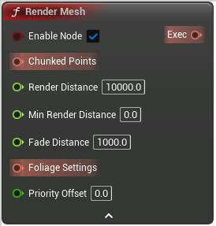

# Render Mesh

<figure><figcaption></figcaption></figure>

Voxel Render Mesh Exec Node

## Inputs

<table>
<thead><tr><th width="170">Type</th><th width="170">Name</th><th>Description</th></tr></thead>
<tbody>
<tr><td>Boolean</td><td>Enable Node</td><td>If false, the node will never be executed</td></tr>
<tr><td>Chunked Point Set</td><td>Chunked Points</td><td>ChunkedPoints</td></tr>
<tr><td>Float</td><td>Render Distance</td><td>RenderDistance</td></tr>
<tr><td>Float</td><td>Min Render Distance</td><td>MinRenderDistance</td></tr>
<tr><td>Float</td><td>Fade Distance</td><td>FadeDistance</td></tr>
<tr><td>Foliage Settings</td><td>Foliage Settings</td><td>FoliageSettings</td></tr>
<tr><td>Double</td><td>Priority Offset</td><td>Priority offset, added to the task distance from camera
Closest tasks are computed first, so set this to a very low value (eg, -1000000) if you want it to be computed first</td></tr>
</tbody>
</table>

## Outputs

<table>
<thead><tr><th width="170">Type</th><th width="170">Name</th><th>Description</th></tr></thead>
<tbody>
<tr><td>Exec</td><td>Exec</td><td>If not connected, will be executed automatically</td></tr>
</tbody>
</table>