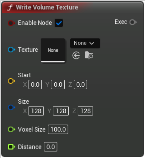

# Write Volume Texture

<figure><figcaption></figcaption></figure>

Voxel Write Volume Texture Exec Node

## Inputs

<table>
<thead><tr><th width="170">Type</th><th width="170">Name</th><th>Description</th></tr></thead>
<tbody>
<tr><td>Boolean</td><td>Enable Node</td><td>If false, the node will never be executed</td></tr>
<tr><td>Volume Texture</td><td>Texture</td><td>Texture</td></tr>
<tr><td>Vector</td><td>Start</td><td>Start</td></tr>
<tr><td>Int Vector</td><td>Size</td><td>Size</td></tr>
<tr><td>Float</td><td>Voxel Size</td><td>VoxelSize</td></tr>
<tr><td>Float Buffer</td><td>Distance</td><td>Distance</td></tr>
</tbody>
</table>

## Outputs

<table>
<thead><tr><th width="170">Type</th><th width="170">Name</th><th>Description</th></tr></thead>
<tbody>
<tr><td>Exec</td><td>Exec</td><td>If not connected, will be executed automatically</td></tr>
</tbody>
</table>