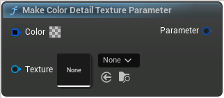

# Make Color Detail Texture Parameter

<figure><figcaption></figcaption></figure>

Make Color Detail Texture Parameter

## Inputs

<table>
<thead><tr><th width="170">Type</th><th width="170">Name</th><th>Description</th></tr></thead>
<tbody>
<tr><td>Linear Color Buffer</td><td>Color</td><td>Color</td></tr>
<tr><td>Color Detail Texture</td><td>Texture</td><td>Texture</td></tr>
</tbody>
</table>

## Outputs

<table>
<thead><tr><th width="170">Type</th><th width="170">Name</th><th>Description</th></tr></thead>
<tbody>
<tr><td>Material Parameter</td><td>Parameter</td><td>Parameter</td></tr>
</tbody>
</table>