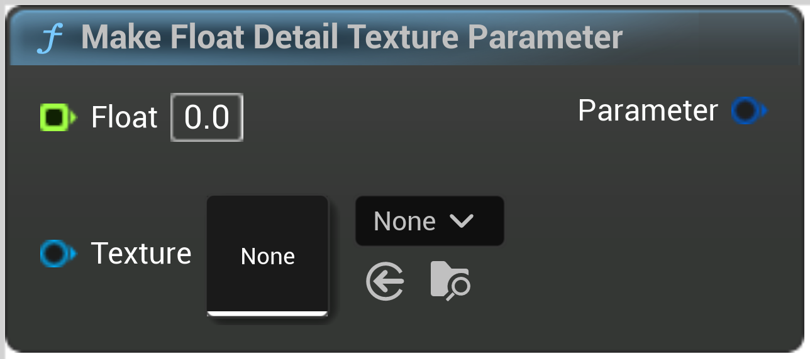

# Make Float Detail Texture Parameter

<figure><figcaption></figcaption></figure>

Make Float Detail Texture Parameter

<table>
<thead><tr><th width="250">Type</th><th width="200">Name</th><th>Description</th></tr></thead>
<tbody>
<tr><td>Float Buffer</td><td>Float</td><td>Float</td></tr>
<tr><td>Float Detail Texture</td><td>Texture</td><td>Texture</td></tr>
<tr><td>Material Parameter</td><td>Parameter</td><td>Parameter</td></tr>
</tbody>
</table>