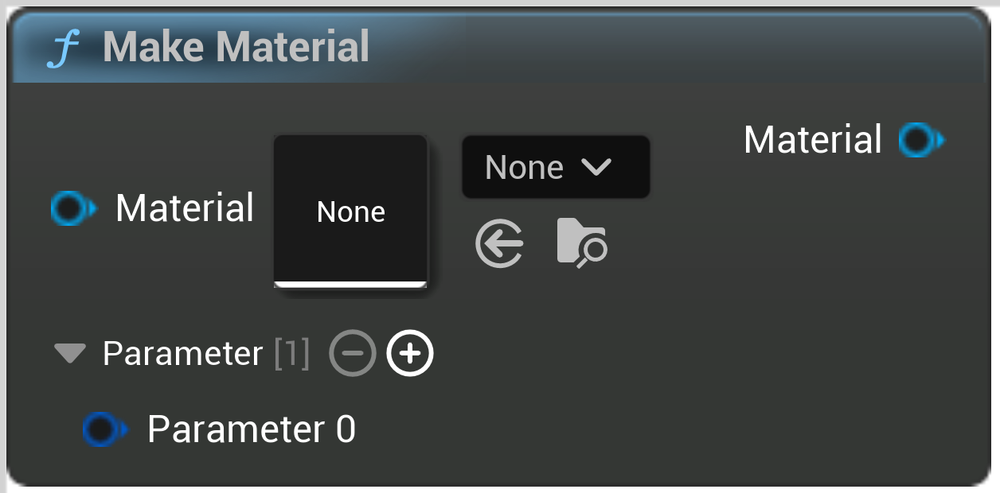

# Make Material

<figure><figcaption></figcaption></figure>

Make Material

## Inputs

<table>
<thead><tr><th width="170">Type</th><th width="170">Name</th><th>Description</th></tr></thead>
<tbody>
<tr><td>Material</td><td>Material</td><td>Material</td></tr>
<tr><td>Material Parameter</td><td>Parameter 0</td><td>Parameter</td></tr>
</tbody>
</table>

## Outputs

<table>
<thead><tr><th width="170">Type</th><th width="170">Name</th><th>Description</th></tr></thead>
<tbody>
<tr><td>Material</td><td>Out Material</td><td>OutMaterial</td></tr>
</tbody>
</table>