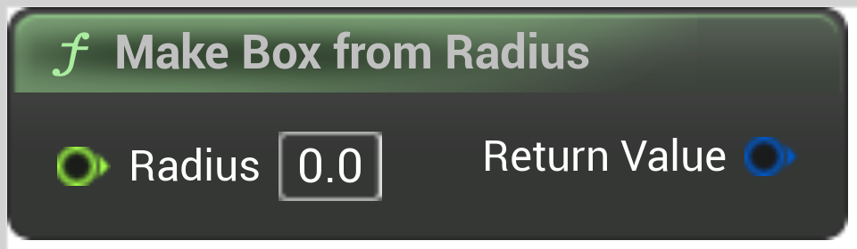

# Make Box from Radius

<figure><figcaption></figcaption></figure>

Make Box from Radius

<table>
<thead><tr><th width="250">Type</th><th width="200">Name</th><th>Description</th></tr></thead>
<tbody>
<tr><td>Float</td><td>Radius</td><td>Make Box from Radius</td></tr>
<tr><td>Box</td><td>Return Value</td><td>Make Box from Radius</td></tr>
</tbody>
</table>