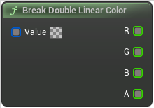

# Break Double Linear Color

<figure><figcaption></figcaption></figure>

Break Double Linear Color

## Inputs

<table>
<thead><tr><th width="250">Type</th><th width="200">Name</th><th>Description</th></tr></thead>
<tbody>
<tr><td>Double Linear Color Buffer</td><td>Value</td><td>Break Double Linear Color</td></tr>
</tbody>
</table>

## Outputs

<table>
<thead><tr><th width="250">Type</th><th width="200">Name</th><th>Description</th></tr></thead>
<tbody>
<tr><td>Double Buffer</td><td>R</td><td>Break Double Linear Color</td></tr>
<tr><td>Double Buffer</td><td>G</td><td>Break Double Linear Color</td></tr>
<tr><td>Double Buffer</td><td>B</td><td>Break Double Linear Color</td></tr>
<tr><td>Double Buffer</td><td>A</td><td>Break Double Linear Color</td></tr>
</tbody>
</table>