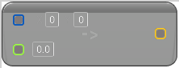

# To Vector (Int Point)

<figure><figcaption></figcaption></figure>

Cast from Int Point to Vector

<table>
<thead><tr><th width="250">Type</th><th width="200">Name</th><th>Description</th></tr></thead>
<tbody>
<tr><td>Int Point Buffer</td><td>Int Point</td><td>Int Point to Vector</td></tr>
<tr><td>Float Buffer</td><td>Z</td><td>Int Point to Vector</td></tr>
<tr><td>Vector Buffer</td><td>Return Value</td><td>Int Point to Vector</td></tr>
</tbody>
</table>