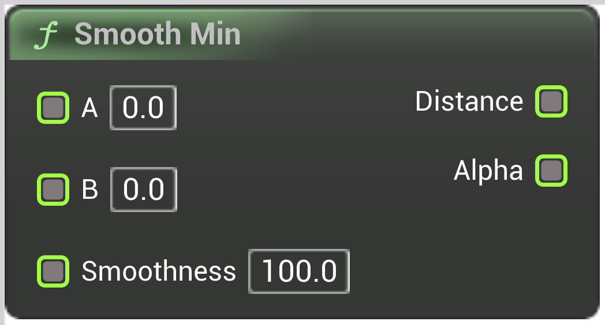

# Smooth Min

<figure><figcaption></figcaption></figure>

Smooth Min

## Inputs

<table>
<thead><tr><th width="250">Type</th><th width="200">Name</th><th>Description</th></tr></thead>
<tbody>
<tr><td>Float Buffer</td><td>A</td><td>Smooth Min</td></tr>
<tr><td>Float Buffer</td><td>B</td><td>Smooth Min</td></tr>
<tr><td>Float Buffer</td><td>Smoothness</td><td>Smooth Min</td></tr>
</tbody>
</table>

## Outputs

<table>
<thead><tr><th width="250">Type</th><th width="200">Name</th><th>Description</th></tr></thead>
<tbody>
<tr><td>Float Buffer</td><td>Out Distance</td><td>Smooth Min</td></tr>
<tr><td>Float Buffer</td><td>Out Alpha</td><td>Smooth Min</td></tr>
</tbody>
</table>