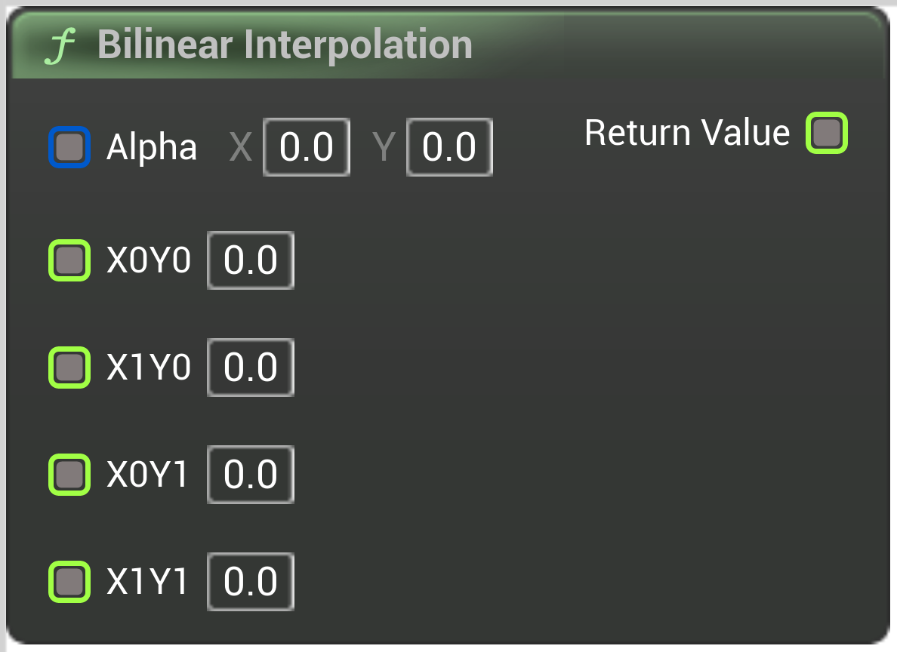

# Bilinear Interpolation

<figure><figcaption></figcaption></figure>

Linearly interpolates between four input values based on input coordinates

<table>
<thead><tr><th width="250">Type</th><th width="200">Name</th><th>Description</th></tr></thead>
<tbody>
<tr><td>Vector 2D Buffer</td><td>Alpha</td><td>Usually frac(Position)</td></tr>
<tr><td>Float Buffer</td><td>X0Y0</td><td>Value at X=0 Y=0</td></tr>
<tr><td>Float Buffer</td><td>X1Y0</td><td>Value at X=1 Y=0</td></tr>
<tr><td>Float Buffer</td><td>X0Y1</td><td>Value at X=0 Y=1</td></tr>
<tr><td>Float Buffer</td><td>X1Y1</td><td>Value at X=1 Y=1</td></tr>
<tr><td>Float Buffer</td><td>Return Value</td><td>Interpolated value</td></tr>
</tbody>
</table>