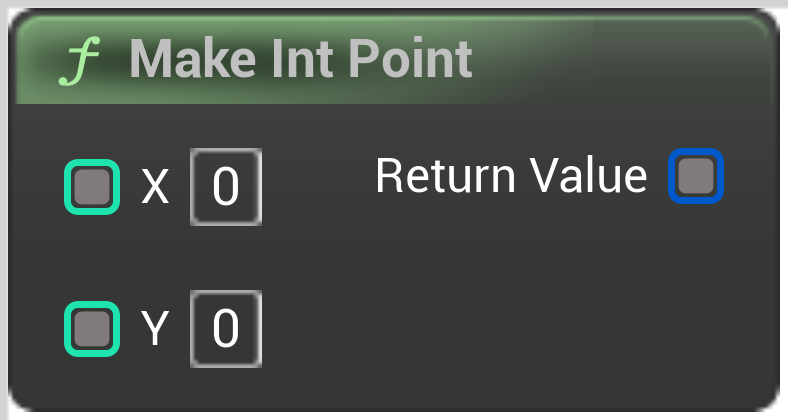

# Make Int Point

<figure><figcaption></figcaption></figure>

Make Int Point

## Inputs

<table>
<thead><tr><th width="170">Type</th><th width="170">Name</th><th>Description</th></tr></thead>
<tbody>
<tr><td>Integer Buffer</td><td>X</td><td>Make Int Point</td></tr>
<tr><td>Integer Buffer</td><td>Y</td><td>Make Int Point</td></tr>
</tbody>
</table>

## Outputs

<table>
<thead><tr><th width="170">Type</th><th width="170">Name</th><th>Description</th></tr></thead>
<tbody>
<tr><td>Int Point Buffer</td><td>Return Value</td><td>Make Int Point</td></tr>
</tbody>
</table>