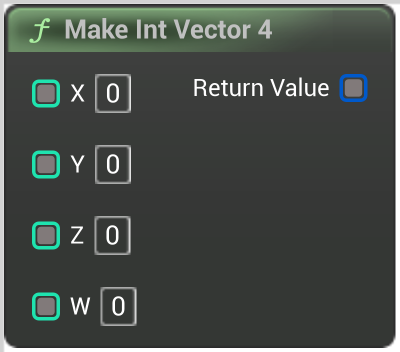

# Make Int Vector 4

<figure><figcaption></figcaption></figure>

Make Int Vector 4

## Inputs

<table>
<thead><tr><th width="250">Type</th><th width="200">Name</th><th>Description</th></tr></thead>
<tbody>
<tr><td>Integer Buffer</td><td>X</td><td>Make Int Vector 4</td></tr>
<tr><td>Integer Buffer</td><td>Y</td><td>Make Int Vector 4</td></tr>
<tr><td>Integer Buffer</td><td>Z</td><td>Make Int Vector 4</td></tr>
<tr><td>Integer Buffer</td><td>W</td><td>Make Int Vector 4</td></tr>
</tbody>
</table>

## Outputs

<table>
<thead><tr><th width="250">Type</th><th width="200">Name</th><th>Description</th></tr></thead>
<tbody>
<tr><td>Int Vector 4 Buffer</td><td>Return Value</td><td>Make Int Vector 4</td></tr>
</tbody>
</table>