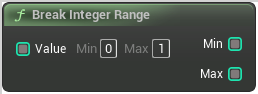

# Break Integer Range

<figure><figcaption></figcaption></figure>

Break Int 32Range

## Inputs

<table>
<thead><tr><th width="250">Type</th><th width="200">Name</th><th>Description</th></tr></thead>
<tbody>
<tr><td>Integer Range Buffer</td><td>Value</td><td>Break Int 32Range</td></tr>
</tbody>
</table>

## Outputs

<table>
<thead><tr><th width="250">Type</th><th width="200">Name</th><th>Description</th></tr></thead>
<tbody>
<tr><td>Integer Buffer</td><td>Min</td><td>Break Int 32Range</td></tr>
<tr><td>Integer Buffer</td><td>Max</td><td>Break Int 32Range</td></tr>
</tbody>
</table>