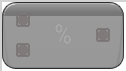

# % (Integer)

<figure><figcaption></figcaption></figure>

Voxel Template Node Modulus

<table>
<thead><tr><th width="250">Type</th><th width="200">Name</th><th>Description</th></tr></thead>
<tbody>
<tr><td>Wildcard Buffer</td><td>A</td><td>A</td></tr>
<tr><td>Wildcard Buffer</td><td>B</td><td>B</td></tr>
<tr><td>Wildcard Buffer</td><td>Result</td><td>Result</td></tr>
</tbody>
</table>