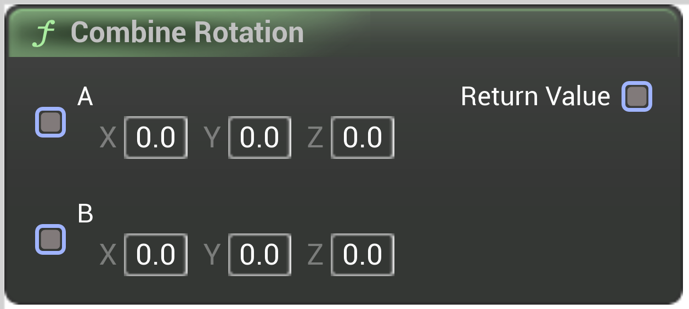

# Combine Rotation

<figure><figcaption></figcaption></figure>

Combine Rotation

## Inputs

<table>
<thead><tr><th width="250">Type</th><th width="200">Name</th><th>Description</th></tr></thead>
<tbody>
<tr><td>Quat Buffer</td><td>A</td><td>Combine Rotation</td></tr>
<tr><td>Quat Buffer</td><td>B</td><td>Combine Rotation</td></tr>
</tbody>
</table>

## Outputs

<table>
<thead><tr><th width="250">Type</th><th width="200">Name</th><th>Description</th></tr></thead>
<tbody>
<tr><td>Quat Buffer</td><td>Return Value</td><td>Combine Rotation</td></tr>
</tbody>
</table>