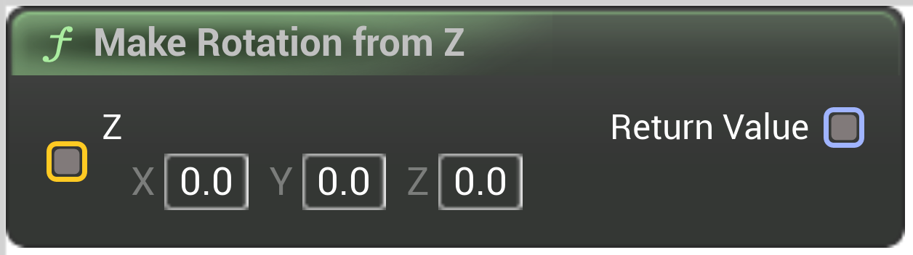

# Make Rotation from Z

<figure><figcaption></figcaption></figure>

Make a rotation from a Z axis. Z doesn't need to be normalized

## Inputs

<table>
<thead><tr><th width="250">Type</th><th width="200">Name</th><th>Description</th></tr></thead>
<tbody>
<tr><td>Vector Buffer</td><td>Z</td><td>Doesn't need to be normalized</td></tr>
</tbody>
</table>

## Outputs

<table>
<thead><tr><th width="250">Type</th><th width="200">Name</th><th>Description</th></tr></thead>
<tbody>
<tr><td>Quat Buffer</td><td>Return Value</td><td>Rotation</td></tr>
</tbody>
</table>