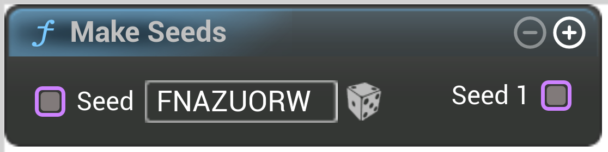

# Make Seeds

<figure><figcaption></figcaption></figure>

Make Seeds

## Inputs

<table>
<thead><tr><th width="250">Type</th><th width="200">Name</th><th>Description</th></tr></thead>
<tbody>
<tr><td>Seed Buffer</td><td>Seed</td><td>Seed</td></tr>
</tbody>
</table>

## Outputs

<table>
<thead><tr><th width="250">Type</th><th width="200">Name</th><th>Description</th></tr></thead>
<tbody>
<tr><td>Seed Buffer</td><td>Seed 0</td><td>Seed_0</td></tr>
</tbody>
</table>