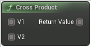

# Cross Product

<figure><figcaption></figcaption></figure>

Voxel Template Node Cross Product

<table>
<thead><tr><th width="250">Type</th><th width="200">Name</th><th>Description</th></tr></thead>
<tbody>
<tr><td>Wildcard Buffer</td><td>V1</td><td>V1</td></tr>
<tr><td>Wildcard Buffer</td><td>V2</td><td>V2</td></tr>
<tr><td>Wildcard Buffer</td><td>Return Value</td><td>ReturnValue</td></tr>
</tbody>
</table>