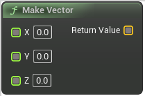

# Make Vector

<figure><figcaption></figcaption></figure>

Make Vector

## Inputs

<table>
<thead><tr><th width="170">Type</th><th width="170">Name</th><th>Description</th></tr></thead>
<tbody>
<tr><td>Float Buffer</td><td>X</td><td>Make Vector</td></tr>
<tr><td>Float Buffer</td><td>Y</td><td>Make Vector</td></tr>
<tr><td>Float Buffer</td><td>Z</td><td>Make Vector</td></tr>
</tbody>
</table>

## Outputs

<table>
<thead><tr><th width="170">Type</th><th width="170">Name</th><th>Description</th></tr></thead>
<tbody>
<tr><td>Vector Buffer</td><td>Return Value</td><td>Make Vector</td></tr>
</tbody>
</table>