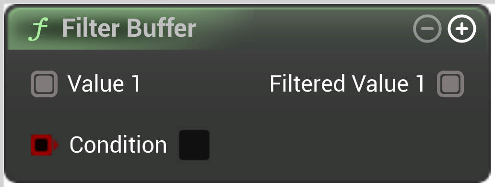

# Filter Buffer

<figure><figcaption></figcaption></figure>

Voxel Template Node Filter Buffer

## Inputs

<table>
<thead><tr><th width="170">Type</th><th width="170">Name</th><th>Description</th></tr></thead>
<tbody>
<tr><td>Wildcard Buffer</td><td>Value 1</td><td>Value_1</td></tr>
<tr><td>Boolean Buffer</td><td>Condition</td><td>Condition</td></tr>
</tbody>
</table>

## Outputs

<table>
<thead><tr><th width="170">Type</th><th width="170">Name</th><th>Description</th></tr></thead>
<tbody>
<tr><td>Wildcard Buffer</td><td>Filtered Value 1</td><td>FilteredValue_1</td></tr>
</tbody>
</table>