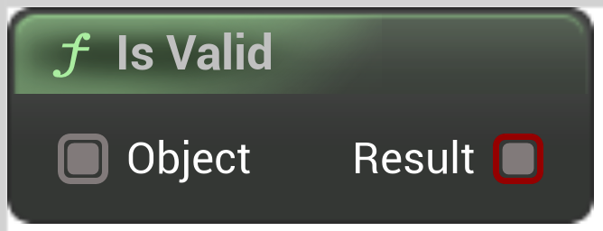

# Is Valid

<figure><figcaption></figcaption></figure>

Is Valid Object

## Inputs

<table>
<thead><tr><th width="170">Type</th><th width="170">Name</th><th>Description</th></tr></thead>
<tbody>
<tr><td>Wildcard Buffer</td><td>Object</td><td>Object</td></tr>
</tbody>
</table>

## Outputs

<table>
<thead><tr><th width="170">Type</th><th width="170">Name</th><th>Description</th></tr></thead>
<tbody>
<tr><td>Boolean Buffer</td><td>Result</td><td>Result</td></tr>
</tbody>
</table>