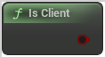

# Is Client

<figure><figcaption></figcaption></figure>

Network client: client connected to a remote server.

<table>
<thead><tr><th width="250">Type</th><th width="200">Name</th><th>Description</th></tr></thead>
<tbody>
<tr><td>Boolean</td><td>Return Value</td><td>Network client: client connected to a remote server.</td></tr>
</tbody>
</table>