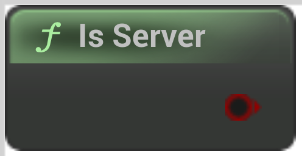

# Is Server

<figure><figcaption></figcaption></figure>

Check if this is a standalone game, a dedicated server or a listen server

<table>
<thead><tr><th width="250">Type</th><th width="200">Name</th><th>Description</th></tr></thead>
<tbody>
<tr><td>Boolean</td><td>Return Value</td><td>Check if this is a standalone game, a dedicated server or a listen server</td></tr>
</tbody>
</table>